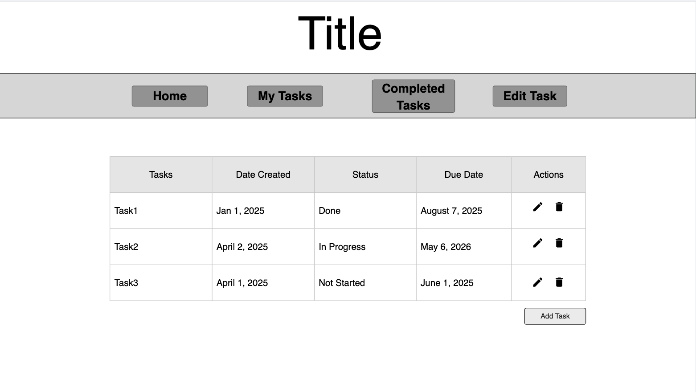

# Final Project

## Project Spec

The general theme I have decided to go with is a task manager website. The goal I want to achieve with this is that users can create, edit, track, and delete tasks. This kind of web application will help users stay organized and manage their time more efficiently. With this kind of theme, I hope to make it accessible to all kinds of people.

This task web application will function as a task tracking tool. Users will be able to perform CRUD operations on a list of tasks at their discretion. The tasks will be stored in a database so that when a user returns to the website, they can view or edit their tasks. Each task will consist of a task name/description, date created, status of the task (done, in progress, not started), due date, and actions you can perform on the task. The core functionality associated with these tasks is that a new task can be added through a new form, you can edit a task through another form, delete a task, mark a task as done/complete, in progress, or not started, and you can view all tasks in a table. 

The target audience for for this website would be the general public, this can include anyone who wants to keep track of their tasks, or wants everything to be more organized. These tasks can be used for any topic, whether that be personal everyday tasks, work, or school. It should be designed simple enough for anyone to be able to use it without much, if any trouble. Anyone should be able to benefit from this website.

The website will manage dynamic data from the user's tasks and keeping track of old/new tasks, editing tasks, status changes, due date, date created, and deleting of a task. The data will be stored in DynamoDB through AWS. If I ever decide to, I think adding a theme preference would be good and it could be stored with each user. 

Once the website is fully functional, there are several stretch goals that I can think of that would be good additions. I would like to enhance user experience and the features that could be available. I would like to add a light/dark theme where a user can choose which they would prefer. Adding task categories, for example, a task can be put under the category school. Adding due date reminders, so a notification could be sent to the user in some way to remind them of an approaching due date for their tasks. Adding a search functionality to search for certain tasks. These are just a few of the features I can think of to add once the main part of the website is fully funcitonal.

## Project Wireframe

